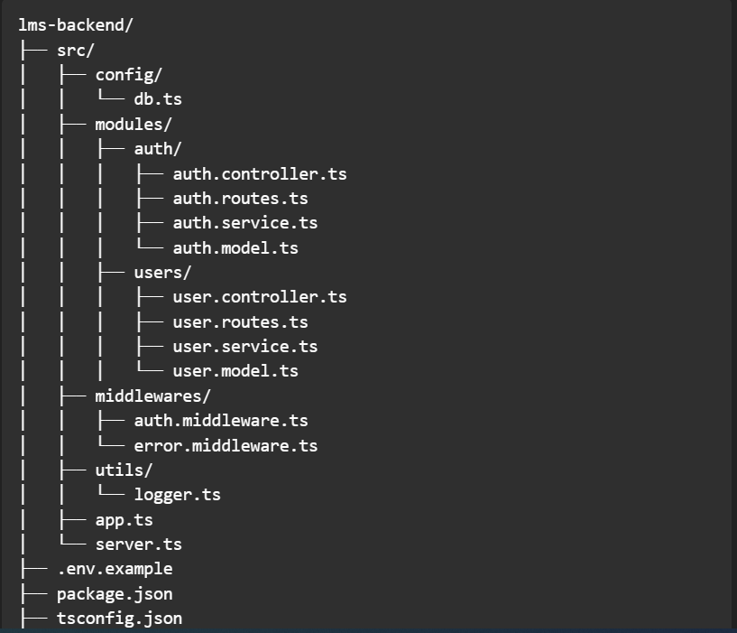

- usage of zod
  

7. What to do next (priority list)
   Create core Mongoose models (User, Class, Subject, Attendance, Fee).

## Quiz Model and planning remaining

Write index creation & seed scripts (seed admin, roles/classes if needed).

Implement authentication (JWT) and auth middleware (protected routes).

Add request validation (Zod schemas) to all incoming routes and centralize validation errors.

Implement RBAC middleware (simple role checks: req.user.role === 'admin' etc.).

Add critical routes for user creation (admin-only) and test them.

Add file-storage plan for materials (S3/MinIO) and plan uploads (signed URLs).

Add tests (unit & integration using Jest + Supertest).

Dockerize app + local docker-compose (Mongo + app) and create CI workflow.

Prepare production readiness: logging, secrets management, monitor, backups, index migration steps.
